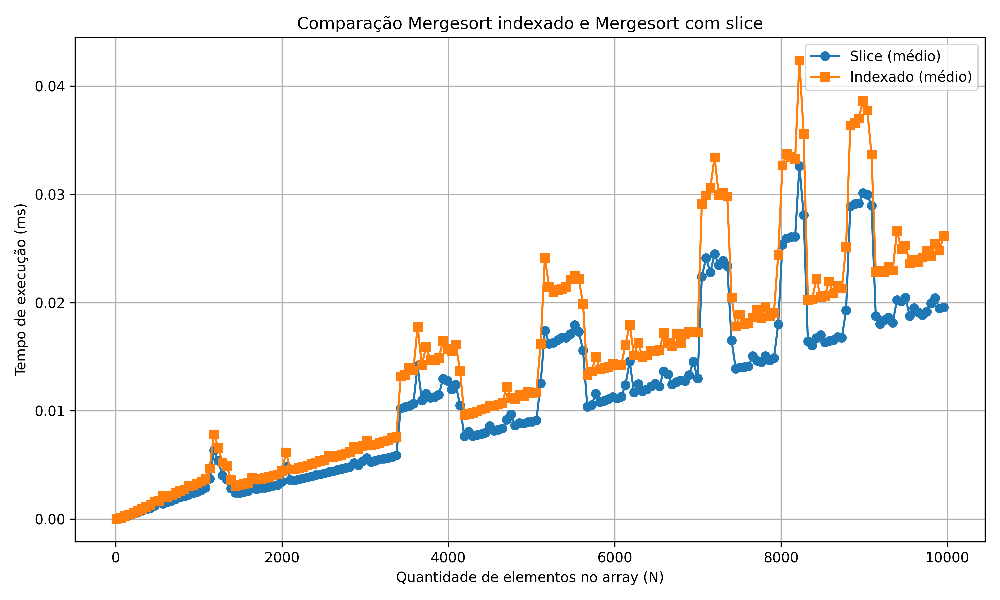

# Comparação de Desempenho de Algoritmos

Este repositório contém o código de um projeto desenvolvido para a disciplina de Análise de Algoritmos. 
O objetivo do projeto foi implementar o algoritmo **Mergesort** de duas maneiras distintas e comparar 
o desempenho de cada uma delas, com foco nos tempos de execução.

## Implementações

### 1. **Mergesort Indexado**

Nesta implementação, o algoritmo utiliza um único array durante todo o processo. As modificações no array 
original acontecem de maneira **in-place**, ou seja, sem a necessidade de alocar novos arrays. 
A ideia é melhorar a eficiência de memória, alterando o array diretamente enquanto ele é dividido e mergeado.

### 2. **Mergesort com Slice**

Nesta versão do Mergesort, o algoritmo utiliza *slices* de arrays. A cada iteração, dois novos arrays são 
criados a partir dos elementos do array original. O **merge** desses arrays gerados resulta no novo array 
original. Embora esse método tenha um custo adicional em termos de alocação de memória, ele pode ser mais 
intuitivo de entender e implementar.

## Resultados

O gráfico abaixo apresenta a comparação do tempo de execução entre as duas implementações de **Mergesort**:

Diferente do que esperávamos, o **Mergesort com Slice** apresentou melhor desempenho em todos os casos,
nos casos de arrays com poucos elementos a diferença era pequena, porém para arrays com grande quantidade
de elementos a diferença é notória.

## Conclusão

Os resultados indicam que, embora a implementação de **Mergesort com Slice** envolva a criação de novos 
arrays durante a execução, ela apresentou melhor desempenho devido às otimizações do Python. O *slicing* 
é uma operação nativa e otimizada em C, o que torna a operação mais rápida. Por outro lado, 
a abordagem **Indexada** realiza operações a mais para retornar elementos ao array original, o que impacta 
negativamente seu tempo de execução, especialmente para grandes quantidades de dados.
